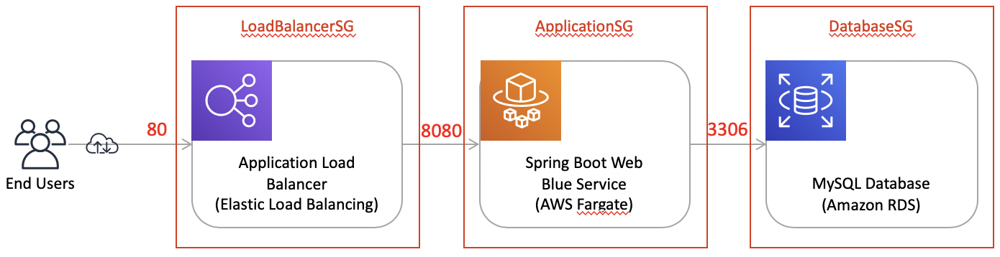
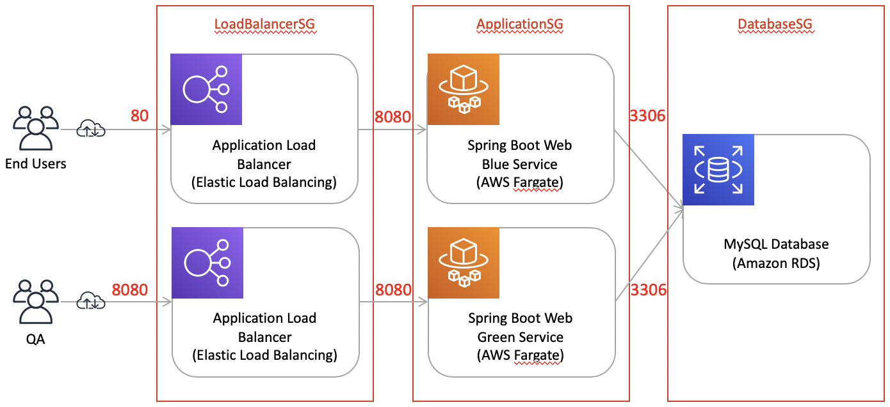

# DevOps at AWS - let's play with AWS Fargate and CodePipeline

(this is based on https://github.com/chtzuehlke/SpringBootFargateCloudFormationSample)

## Overview

### Sample application (dev environment)

Dev environment (managed by AWS CloudFormation):
- HTTP reverse proxy (AWS Application Load Balancer)
- A simple REST service (dockerized Spring Boot web application with flyway for automated DB migration)
- A simple relational DB schema (AWS RDS for MySQL)

### Sample application (test environment)

Test environment (managed by AWS CloudFormation):
- Blue service serves end user traffic
- Green service serves test traffic during blue/gren deployment

### Container registry and runtime

Container management infrastructure (managed by AWS CloudFormation):
- Private docker registry (AWS ECR)
- Serverless container execution environment (AWS Fargate)

### CI/CD pipeline

Infrastructure (managed by AWS CloudFormation):
- Private git repository (AWS CodeCommit)
- A simple CI/CD pipeline (AWS CodePipeline)
- Docker-based build jobs (AWS CodeBuild)

Pipeline (build, dev deployment, test blue/green deployment):
- Source stage: a `git push` (wired via CloudWatch events) triggers master branch checkout from CodeCommit repository
- Build stage: build Spring Boot runnable jar and docker image (maven, docker), push docker image v(n) to private docker registry, assemble CloudFormation Fargate (dev) stack-update properties
- DeployBlue stage: update Fargate (dev) environment: running task will be replaced by a new task based on docker image v(n)
- (Automated integration tests stage is not implemented yet)
- Stage2Build phase: assemble CloudFormation Fargate (test) stack- and CloudFormation Load Balancer (test) stack-update properties
- Stage2DeployGreen phase: update current Fargate (test) green service to docker image v(n). Current Fargate (test) blue service, based on docker image v(&lt;n), is still serving end user traffic
- (Manual testing- and approval phase is not implemented yet)
- Stage2ToggleBlueGreen phase: update Load Balancer (test) stack to switch roles of the blue and the green service. End user traffic is now served by the newly promoted blue service, based on docker image v(n). The green service, based on docker image v(&lt;n), is still available for immediate rollback.

## Infrastructure-as-Code with CloudFormation

Pre-Conditions:
- AWS CLI installed & configured (sufficient IAM permissions, default region configured)
- Default VPC is present in the default AWS region
- Docker is installed and running
- Linux-like environment or macOS (bash, curl, sed, ...)
- openssl installed (used for password generation)
- General advice: read - and understand - all shell scripts and CloudFormation YAML templates before executing them
- Create a SSH key pair and associate the public key with your IAM user
- Git push to CodeCommit also requires configuration in ~/.ssh/config (see https://docs.aws.amazon.com/codecommit/latest/userguide/setting-up-ssh-unixes.html)

Disclaimer:
- Not production ready yet (e.g. automation scripts w/o error handling)

### Infrastructure setup - from zero to production in 24'

	./setup-showcase.sh

### Deployment - from push to production in 6'

Push new version trough the pipeline:

	git push aws

### Infrastructure teardown - from production to zero in xx'

	./teardown-showcase.sh

## TODOs

- Get rid of green service in dev env (not required)
- Resource taggig
- Least privilege IAM roles
- Error handling in scripts
- Automated integration tests (dev)
- Automated smoke tests (test)
- Manual approval step
- Switch to CDK
- CloudWatch alarms (e.g. application error log count > 0)
- Fix CloudWatch logging helpers (blue/green)
- ...
